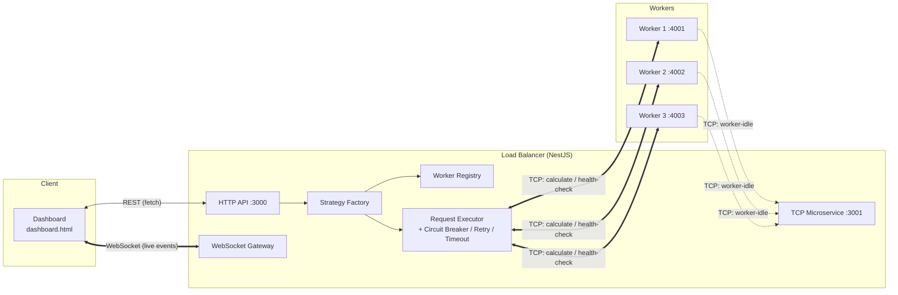
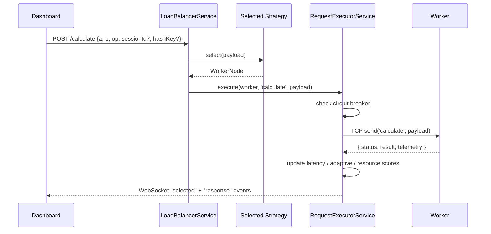

# 🔀 NestJS Distributed Load Balancer Simulator

A hands-on simulation of a **distributed load balancing system**, built with **NestJS microservices** (TCP transport), a pluggable **strategy engine** with 12 different load-balancing algorithms, and a **real-time WebSocket dashboard** to watch requests get routed, workers fail, and metrics update live.

This project was built to explore how real load balancers make routing decisions (round robin, least connections, consistent hashing, adaptive scoring, etc.), and to visualize resilience patterns like **circuit breakers**, **retries**, **timeouts**, and **health checks** in action.

> 💡 Not intended for production use — this is an educational / portfolio simulation of load balancing concepts.

---

## 📖 Table of Contents

- [Overview](#-overview)
- [Features](#-features)
- [Architecture](#-architecture)
- [Load Balancing Strategies](#-load-balancing-strategies)
- [Resilience Mechanisms](#-resilience-mechanisms)
- [Tech Stack](#-tech-stack)
- [Project Structure](#-project-structure)
- [Getting Started](#-getting-started)
- [Configuration](#-configuration)
- [API Reference](#-api-reference)
- [WebSocket Events](#-websocket-events)
- [Simulated Worker Behavior](#-simulated-worker-behavior)
- [Dashboard Guide](#-dashboard-guide)

---

## 🧭 Overview

The system is made up of three moving parts:

1. **Load Balancer (LB)** — a NestJS app that registers workers, exposes a REST API, picks a worker for every incoming request according to the currently selected strategy, and streams everything happening internally over WebSockets.
2. **Worker(s)** — lightweight NestJS microservices that simulate doing "work" (basic math operations), report CPU/RAM telemetry, and randomly fail or slow down to give the load balancer something interesting to react to.
3. **Dashboard** — a single static `dashboard.html` file (no build step) that visualizes the whole cluster in real time: worker cards, live request routing animations, health/adaptive/resource scores, and one-click controls to switch strategies, destroy/fix workers, and run load tests.

---

## ✨ Features

- ⚖️ **12 pluggable load balancing strategies** (see table below), swappable at runtime with no restart
- 📡 **Real-time dashboard** via Socket.IO — animated request routing, live worker health, telemetry bars
- 🔌 **NestJS microservices over TCP** for load balancer ↔ worker communication
- 🧯 **Circuit breaker** per worker (closed → open → half-open)
- 🔁 **Retry + timeout** wrapper, toggleable as a simulated "Service Mesh" execution mode
- ❤️ **Active health checks** with a configurable interval, auto-enabled for the health-aware strategy
- 🧮 **Composite scoring**: adaptive score, resource score, and health score computed per worker from live metrics
- 💥 **Chaos built into the worker**: simulated random failures, slow responses, and heavier delay for "expensive" operations
- 🧑‍🤝‍🧑 **Multi-worker registry**: register, destroy, fix, and reset workers on the fly via REST
- 🔑 **Session & key aware routing** for sticky sessions and consistent hashing (`sessionId`, `hashKey` in the payload)

---

## 🏗️ Architecture



**Request flow** for `POST /calculate`:



---

## ⚖️ Load Balancing Strategies

The active strategy can be changed at any time via `POST /strategy` or the dashboard buttons — no restart required.

| Strategy                   | Key                          | How it picks a worker                                                                                                                                       |
| -------------------------- | ---------------------------- | ----------------------------------------------------------------------------------------------------------------------------------------------------------- |
| Round Robin                | `round-robin`                | Cycles sequentially through all registered workers, skipping destroyed ones.                                                                                |
| Least Connections          | `least-connections`          | Picks the worker with the fewest active connections; ties are broken randomly.                                                                              |
| Power of Two Choices       | `power-of-two`               | Randomly samples two workers and picks whichever has fewer active connections.                                                                              |
| Health-Aware               | `health-aware`               | Picks the healthy worker with the lowest **health score**. Automatically starts a background health-check loop while active.                                |
| Weighted Round Robin       | `weighted-round-robin`       | Expands the worker list so each worker appears `weight` times, then round-robins through it.                                                                |
| Weighted Least Connections | `weighted-least-connections` | Picks the worker with the lowest `activeConnections / weight` ratio.                                                                                        |
| Consistent Hashing         | `consistent-hashing`         | Builds a hash ring (1000 virtual nodes per worker) and routes by hashing `payload.hashKey`, keeping the same key on the same worker as the cluster changes. |
| Sticky Session             | `sticky-session`             | Maps a `sessionId` to a worker on first contact and keeps sending it there for the life of the session.                                                     |
| Latency-Based              | `latency-based`              | Picks the healthy worker with the lowest smoothed (EMA) latency.                                                                                            |
| Resource-Aware             | `resource-aware`             | Picks the worker with the lowest **resource score** (CPU + RAM + connection load).                                                                          |
| Adaptive                   | `adaptive`                   | Picks the worker with the lowest **adaptive score**, a blended metric of error rate, queue depth, latency, and telemetry.                                   |
| Join-Idle-Queue            | `join-idle-queue`            | Workers proactively tell the LB when they go idle; the LB pulls the next worker off that idle queue instead of polling load.                                |

If an unknown strategy name is ever set, the factory silently falls back to **Least Connections**.

---

## 🧯 Resilience Mechanisms

| Mechanism             | Behavior                                                                                                                                                                                      |
| --------------------- | --------------------------------------------------------------------------------------------------------------------------------------------------------------------------------------------- |
| **Circuit Breaker**   | Opens after **3** consecutive failures for a worker. Stays open for **10s**, then moves to half-open to test recovery. Workers with an open circuit are excluded from `getAvailableWorker()`. |
| **Retry**             | Retries a failed call up to **2** extra times (3 attempts total). Only active in `ServiceMeshBehavior` execution mode.                                                                        |
| **Timeout**           | Races the worker call against a **5s** timeout. Only active in `ServiceMeshBehavior` execution mode.                                                                                          |
| **Health Checks**     | Every **5s**, pings each worker with a `health-check` message and recomputes its health score; only runs while the `health-aware` strategy is active.                                         |
| **Latency Smoothing** | Uses an exponential moving average (α = 0.3) so one slow response doesn't wildly swing routing decisions. A failed call **penalizes** smoothed latency (`×1.5 + 1500ms`, capped at 10s).      |

You can flip between the two execution modes live from the dashboard's **"🔄 Normal / 🕸️ Service Mesh"** button, or via `POST /executeBehavior`.

**Scoring formulas** (computed per worker on every response):

```text
adaptiveScore  = errorRate*0.4 + min(100, queueDepth)*0.3 + latencyScore*0.2 + cpuUsage*0.05 + memoryUsage*0.05
resourceScore  = cpuUsage*0.45 + memoryUsage*0.35 + min(100, connectionLoad)*0.2
healthScore    = (activeConnections*10) + failureRate + (lastResponseTime > 3000 ? 50 : 0)
```

Lower scores = healthier / more available worker, for every strategy that uses them.

---

## 🧰 Tech Stack

- **[NestJS](https://nestjs.com/)** (TypeScript) — both the load balancer and the workers
- **`@nestjs/microservices`** — TCP transport for LB ↔ worker communication
- **`@nestjs/websockets` + Socket.IO** — real-time event streaming to the dashboard
- **Axios** — worker self-registration with the load balancer on boot
- **RxJS** — `firstValueFrom` for TCP message/response handling
- **Vanilla HTML/CSS/JS** — the dashboard, no framework or build step required

---

## 📁 Project Structure

> Layout below reflects how the code is organized; adjust paths if your repo groups things differently (e.g. an npm/pnpm workspace).

```
project-root/
├── load-balancer/                      # Main NestJS load balancer app
│   ├── src/
│   |   ├── main.ts                     # Bootstraps HTTP (3000) + TCP microservice (3001)
│   |   ├── app.module.ts
│   |   ├── app.controller.ts
│   |   ├── app.service.ts
│   |   └── load_balancer/
│   |       ├── interfaces/             # Payload, response, worker, health, strategy types
│   |       ├── load-balancer.controller.ts   # REST endpoints
│   |       ├── load-balancer.gateway.ts      # WebSocket gateway (broadcasts events)
│   |       ├── load-balancer.module.ts
│   |       ├── load-balancer.service.ts      # Orchestrates strategy + execution
│   |       ├── services/
│   |       │   ├── circuit-breaker.service.ts
│   |       │   ├── health-check.service.ts
│   |       │   ├── idle-queue.service.ts
│   |       │   ├── request-executor.service.ts
│   |       │   ├── retry.service.ts
│   |       │   ├── timeout.service.ts
│   |       │   ├── worker-metrics.service.ts
│   |       │   └── worker-registry.service.ts
│   |       └── strategies/
│   |           ├── round-robin.strategy.ts
│   |           ├── least-connections.strategy.ts
│   |           ├── power-of-two.strategy.ts
│   |           ├── health-aware.strategy.ts
│   |           ├── weighted-round-robin.strategy.ts
│   |           ├── weighted-least-connections.strategy.ts
│   |           ├── consistent-hashing.strategy.ts
│   |           ├── sticky-session.strategy.ts
│   |           ├── latency-based.strategy.ts
│   |           ├── Resource_aware.strategy.ts
│   |           ├── adaptive.strategy.ts
│   |           ├── join-idle-queue.strategy.ts
│   |           ├── strategy.factory.ts
│   |           └── strategy.interface.ts
|   |
|   └── dashboard.html                  # Real-time cluster dashboard (open directly in a browser)
|
│
├── worker/                             # Worker microservice (run N copies with different env vars)
│   └── src/
│       ├── main.ts                     # Boots TCP microservice, self-registers with the LB
│       ├── app.module.ts
│       ├── app.controller.ts
│       └── app.service.ts              # calculate / health-check / telemetry simulation
│
└── README.md
```

---

## 🚀 Getting Started

### Prerequisites

- **Node.js** 18+ and **npm**
- Two terminals (or more, for extra workers) — one for the load balancer, one per worker

### 1. Install dependencies

```bash
cd load-balancer
npm install

cd ../worker
npm install
```

### 2. Start the load balancer

```bash
cd load-balancer
npm run start:dev
```

This starts:

- the HTTP API on **`http://localhost:3000`**
- an internal TCP microservice on **port 3001** (used by workers to report when they go idle)

### 3. Start one or more workers

Each worker is the same codebase — just launch it multiple times with different environment variables:

```bash
# Terminal 2
WORKER_NAME=worker-1 PORT=4001 WORKER_WEIGHT=3 npm run start:dev

# Terminal 3
WORKER_NAME=worker-2 PORT=4002 WORKER_WEIGHT=5 npm run start:dev

# Terminal 4
WORKER_NAME=worker-3 PORT=4003 WORKER_WEIGHT=2 npm run start:dev
```

On boot, each worker automatically calls `POST http://localhost:3000/register` to join the cluster.

### 4. Open the dashboard

Just open `dashboard.html` directly in your browser (or serve it with any static server / Live Server extension). It connects to `http://localhost:3000` for the REST API and WebSocket events — CORS is already enabled on the load balancer for this.

Then use the sidebar to:

- switch strategies
- run a basic test (`▶ Run`) or a stress test (`⚡ Stress`)
- destroy / fix individual workers
- toggle between **Normal** and **Service Mesh** execution behavior
- reset the whole cluster's stats

---

## ⚙️ Configuration

### Load Balancer

| Variable  | Default | Description                                                  |
| --------- | ------- | ------------------------------------------------------------ |
| `PORT`    | `3000`  | HTTP API port                                                |
| _(fixed)_ | `3001`  | TCP microservice port (used for `worker-idle` notifications) |

### Worker

| Variable               | Description                                             |
| ---------------------- | ------------------------------------------------------- |
| `PORT` / `WORKER_PORT` | TCP port the worker listens on                          |
| `WORKER_NAME`          | Unique name used for registration and dashboard display |
| `WORKER_WEIGHT`        | Used by weighted strategies                             |
| `WORKER_CPU_CORES`     | Reported metadata (not used in scoring directly)        |
| `WORKER_MEMORY_GB`     | Reported metadata (not used in scoring directly)        |
| `WORKER_CPU_BASE`      | Baseline % added to simulated CPU telemetry             |
| `WORKER_RAM_BASE`      | Baseline % added to simulated RAM telemetry             |

---

## 📡 API Reference

All endpoints are exposed by the load balancer on `http://localhost:3000`.

| Method | Endpoint           | Body                                              | Description                                                                                                  |
| ------ | ------------------ | ------------------------------------------------- | ------------------------------------------------------------------------------------------------------------ |
| `GET`  | `/worker`          | —                                                 | List every registered worker and its current metrics.                                                        |
| `GET`  | `/process_info`    | —                                                 | Returns workers + current strategy + current execution behavior in one call (used by the dashboard on load). |
| `POST` | `/register`        | `{ name, port, weight, cpuCores, memoryGB }`      | Register a new worker, or update an existing one at the same port.                                           |
| `POST` | `/calculate`       | `{ a, b, op, sessionId?, hashKey? }`              | Route a math operation (`add` / `sub` / `mul`) to a worker chosen by the current strategy.                   |
| `POST` | `/destroy/:port`   | —                                                 | Mark the worker at `port` as destroyed/unhealthy (simulated crash).                                          |
| `POST` | `/fix/:port`       | —                                                 | Restore a previously destroyed worker.                                                                       |
| `POST` | `/reset`           | —                                                 | Reset stats (connections, requests, failures, health) for every worker.                                      |
| `POST` | `/strategy`        | `{ strategy }`                                    | Switch the active load-balancing strategy.                                                                   |
| `POST` | `/executeBehavior` | `{ behavior: "normal" \| "ServiceMeshBehavior" }` | Toggle whether requests go through the retry + timeout wrapper.                                              |

Example:

```bash
curl -X POST http://localhost:3000/calculate \
  -H "Content-Type: application/json" \
  -d '{"a": 12, "b": 4, "op": "mul", "sessionId": "session-abc", "hashKey": "user-alice"}'
```

> **Note:** the worker also exposes `worker-destroy` / `worker-fix` TCP message patterns internally, but the current load balancer controls destroy/fix state directly through its own registry rather than calling those — they're there for direct worker-side testing.

---

## 🔌 WebSocket Events

The gateway broadcasts a single `log` event with a `type` field the dashboard switches on:

| Type        | Meaning                                                                           |
| ----------- | --------------------------------------------------------------------------------- |
| `register`  | A worker registered or re-registered.                                             |
| `state`     | A worker's metrics were recalculated (health/adaptive/resource score, telemetry). |
| `selected`  | A worker was chosen to handle a request.                                          |
| `response`  | A request completed successfully.                                                 |
| `error`     | A request failed on the selected worker.                                          |
| `destroyed` | A worker was marked as destroyed.                                                 |
| `fixed`     | A worker was restored.                                                            |
| `strategy`  | The active strategy changed.                                                      |

---

## 🎲 Simulated Worker Behavior

To give the load balancer something realistic to react to, each worker's `calculate` handler intentionally misbehaves a little:

- Every call has a baseline **~3s** processing delay.
- **Every 5th request fails outright** (to exercise retries / circuit breaker).
- **Every 7th request** adds another **~5.5s** delay (to exercise timeouts).
- A "heavy" multiplication (`op: 'mul'` with `a > 100`) adds an extra **~1.5s**.
- CPU/RAM telemetry blends real host `os.cpus()` / `os.freemem()` readings with a per-worker base offset and a bit of random jitter, so different workers can be tuned to look "busier" than others via `WORKER_CPU_BASE` / `WORKER_RAM_BASE`.

---

## 🖥️ Dashboard Guide

- **Cluster Topology** — the load balancer sits at the top center; worker cards are arranged below it, connected by animated lines. Blue pulses show requests in flight, green/red ripples show success/failure.
- **Worker Card** — shows active/total/failed requests, smoothed latency, weight, load ratio, CPU/RAM bars, resource score, adaptive score, and health score, plus a **Destroy** / **Fix** button.
- **Actions Panel** — `Run` fires a small sequential test, `Stress` fires a burst of concurrent requests, `Reset` clears all stats, and the mode button toggles Normal vs. Service Mesh execution.
- **Strategies Panel** — one click to switch the live routing algorithm; a ✨ dot marks the newer strategies.
- **Event Stream** — a scrolling log of everything happening in the cluster in real time.
